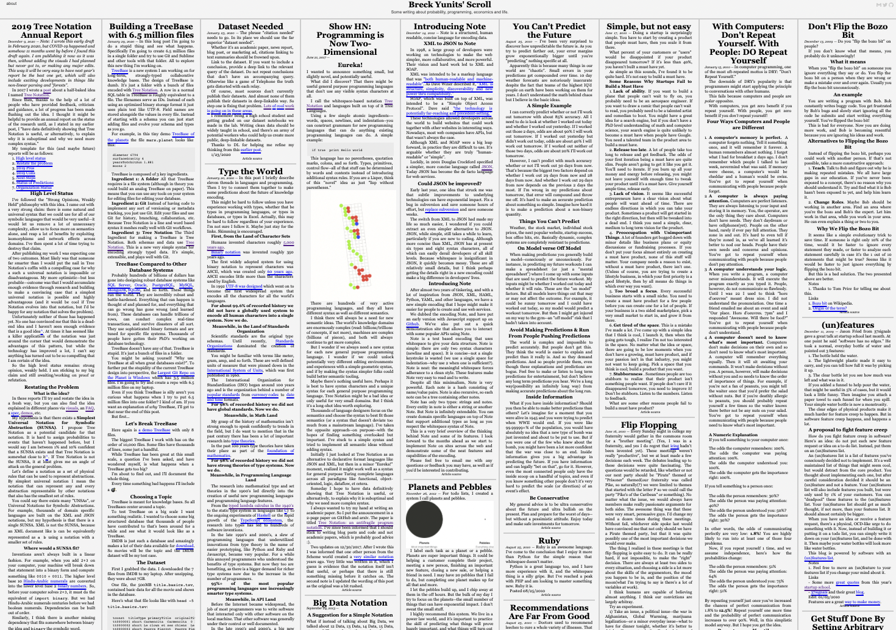

# 📜 Scroll: A new way to publish

Scroll is simple static publishing software. Example site:

<a href="https://breckyunits.com/"></a>

# What makes Scroll different?

1. Instead of a page per post, like a blog, a Scroll is a
   **single page**, like an old newspaper.
2. Instead of Markdown, Scrolls use <a
   href="https://github.com/treenotation/dumbdown">**Dumbdown**</a>,
   which makes it easy to combine languages to generate more
   creative content.
3. Instead of supporting licenses, Scroll is 100% focused on
   **public domain sites** and everything is
   designed with that assumption.

## How do I get Scroll?

Scroll is part of the <a href="https://www.npmjs.com/package/dumbdown-js"> dumbdown-js package on npm</a>.

You can get it by typing:

```
npm install -g dumbdown-js
```

## How do I use Scroll?

Scroll is used through the CLI. To see the options type:

```
scroll help
```

## Where do I get help?

Post an issue in this GitHub, join the <a href="https://www.reddit.com/r/treenotation/">Tree Notation subreddit</a> or email breck7@gmail.com.

### What are some example sites using Scroll?

On beta launch day we have:

- https://breckyunits.com/

Note: looking for beta users to share their sites!

### How does Scroll work?

<em>A Scroll</em> is a single folder containing Dumbdown files.
Scroll compiles those Dumbdown files into a static
index.html page. (Note: technically the language Scroll uses
is called Scroll, which is a dialect of Dumbdown).

Scroll is also the name of the command line app that includes a
simple Node.js Express app for live preview.

Scroll is also the name of a Tree Language defined in this <a href="https://github.com/treenotation/dumbdown/blob/master/scroll/scroll.grammar">grammar</a>.

### What does a typical project folder look like?

A typical Scroll project folder looks like this:

```
yourScrollProject/
 someDraft.dd
 readme.md
 yourDomainName.org/
  about.dd
  publishedArticle.dd
  anImageInTheArticle.png
  index.html
  scrollSettings.map
```

The `scrollSettings.map` file let's Scroll know that
a folder contains a Scroll.

When you "build" a Scroll site, you are simply generating
the `index.html` file in the site's folder.

The suggested project layout above let's you easily
separate drafts from published content and put all
under version control.

With Scroll your site's public static files, generated html,
and published article source Dumbdown files, are all in the
public folder and checked into version control.

### How do I save drafts?

Save them outside your public folder like in the sample project
folder above.

### What File Formats does Scroll use?

Scroll articles are written as Dumbdown files with the file
extension `dd`. (Note: technically the language Scroll uses
is called Scroll, which is a dialect of Dumbdown). The
grammar for Scroll is fully defined <a href="https://github.com/treenotation/dumbdown/blob/master/scroll/scroll.grammar">here</a>

Entire Scrolls are saved as <a href="https://github.com/treenotation/jtree/blob/master/langs/stamp/readme.md">
stamp</a> files with the extension `stamp`.

### What languages is Scroll written in?

The Scroll app is written in plain Javascript and
runs in Node.js.

Scroll makes heavy use of Tree Languages. The CSS is
written in <a href="https://jtree.treenotation.org/designer/#standard%20hakon">Hakon</a>.
The HTML is written in <a href="https://jtree.treenotation.org/designer/#standard%20stump"> stump</a>.

TypeScript may be used in the future but Scroll may
never get over 1kloc so that might not be necessary.

### How does versioning of articles work?

Scroll is designed for git. A single article is stored as
a single file tracked by git.

### Why is Scroll a single page?

Being able to scan the page like a newspaper is a
very fast reading experience. This is central to Scroll.

Additionally, making it easy to take the content with
you, and transform it to better suit the reader, is
also key to Scroll.

Because Scroll is designed for public domain sites,
we can optimize for the single page reading experience
but people can have the full Scroll contents and render
it however best suits them.

### Will you make design decisions for non-public domain sites?

No.

### Can I use Scroll for internal private sites not intended for publishing?

Yes!

### Will you support publishing single pages for better SEO?

No. However, the API for Scroll is incredibly simple—a Scroll
is just a folder with some Dumbdown files and a settings file.
Everything is in Tree Notation and public domain. So it would
be very easy for someone to write some software to generate
single pages if that's something people want.

### Will you support publishing snippets?

No. But will support making it easier for someone to do that in a fork
or via plugins.

### Will you support newest articles flowing right to left instead of having potentially older articles up top?

No. But will support making it easier for someone to do that in a fork
or via plugins.

### What were some alternatives considered?

There was no publishing software that reads and writes Dumbdown yet
so building Scroll was necessary. Jekyll and Brecksblog are 2 biggest
inspirations.

- https://jekyllrb.com/
- https://github.com/breck7/brecksblog

### What has changed in recent versions?

Version 4.2.0 released on 02-22-2021
 fixed paragraph parsing and rendering
Version 4.1.0 released on 02-22-2021
 added a "git" scrollSetting for article source links.

### Is there a place I can play with the Scroll grammar and see how it compiles to HTML?

Yes. <a href="https://jtree.treenotation.org/designer/#grammar%0A%20anyCell%0A%20blankCell%0A%20dashCell%0A%20%20highlightScope%20constant.language%0A%20codeCell%0A%20%20highlightScope%20comment%0A%20keywordCell%0A%20%20highlightScope%20keyword%0A%20textCell%0A%20%20highlightScope%20string%0A%20urlCell%0A%20%20highlightScope%20constant.language%0A%20errorNode%0A%20%20baseNodeType%20errorNode%0A%20dumbdownNode%0A%20%20extensions%20dd%20dumbdown%0A%20%20description%20A%20prefix%20Tree%20Language%20that%20compiles%20to%20HTML.%20An%20alternative%20to%20Markdown.%0A%20%20root%0A%20%20inScope%20abstractTopLevelNode%20blankLineNode%0A%20%20catchAllNodeType%20quickParagraphNode%0A%20%20compilesTo%20html%0A%20%20example%0A%20%20%20title%20Hello%20world%0A%20%20%20subtitle%20This%20is%20dumbdown%0A%20%20%20%0A%20%20%20paragraph%20It%20compiles%20to%20HTML.%20Blank%20lines%20get%20turned%20into%20brs.%0A%20%20%20link%20https%3A%2F%2Ftreenotation.org%20dumbdown%20is%20a%20Tree%20Language.%0A%20%20%20list%0A%20%20%20%20-%20It%20has%20lists%0A%20%20%20%20-%20Too!%0A%20%20%20code%0A%20%20%20%20%2F%2F%20You%20can%20add%20code%20as%20well.%0A%20%20%20%20print(%22Hello%20world%22)%0A%20abstractTopLevelNode%0A%20%20abstract%0A%20%20cells%20keywordCell%0A%20linkNode%0A%20%20cells%20keywordCell%20urlCell%0A%20%20catchAllCellType%20textCell%0A%20%20extends%20abstractTopLevelNode%0A%20%20compiler%0A%20%20%20stringTemplate%20%3Ca%20href%3D%22%7BurlCell%7D%22%3E%7BtextCell%7D%3C%2Fa%3E%0A%20%20crux%20link%0A%20paragraphNode%0A%20%20catchAllNodeType%20paragraphContentNode%0A%20%20extends%20abstractTopLevelNode%0A%20%20crux%20paragraph%0A%20%20compiler%0A%20%20%20openChildren%20%3Cp%3E%0A%20%20%20closeChildren%20%3C%2Fp%3E%0A%20%20%20stringTemplate%20%0A%20paragraphContentNode%0A%20%20inScope%20paragraphContentNode%0A%20%20catchAllCellType%20textCell%0A%20%20compiler%0A%20%20%20stringTemplate%20%7BtextCell%7D%0A%20codeNode%0A%20%20description%20A%20code%20block.%0A%20%20catchAllNodeType%20lineOfCodeNode%0A%20%20extends%20abstractTopLevelNode%0A%20%20todo%20Fix%20spacing%0A%20%20compiler%0A%20%20%20openChildren%20%3Cdiv%20class%3D%22scrollArticleCode%22%3E%0A%20%20%20closeChildren%20%3C%2Fdiv%3E%0A%20%20%20stringTemplate%20%0A%20%20crux%20code%0A%20listNode%0A%20%20inScope%20dashNode%0A%20%20extends%20abstractTopLevelNode%0A%20%20compiler%0A%20%20%20stringTemplate%20%0A%20%20%20openChildren%20%3Cul%3E%0A%20%20%20closeChildren%20%3C%2Ful%3E%0A%20%20crux%20list%0A%20blankLineNode%0A%20%20description%20Blank%20lines%20compile%20to%20nothing%20in%20the%20HTML.%0A%20%20cells%20blankCell%0A%20%20compiler%0A%20%20%20stringTemplate%20%0A%20%20pattern%20%5E%24%0A%20%20tags%20doNotSynthesize%0A%20lineOfCodeNode%0A%20%20catchAllCellType%20codeCell%0A%20%20catchAllNodeType%20lineOfCodeNode%0A%20%20javascript%0A%20%20%20compile()%20%7B%0A%20%20%20%20%20return%20%60%3Ccode%3E%24%7Bthis.getIndentation()%7D%24%7Bthis.getLine()%7D%3C%2Fcode%3E%24%7Bthis.map(child%20%3D%3E%20child.compile()).join(%22%5Cn%22)%7D%60%0A%20%20%20%7D%0A%20dashNode%0A%20%20crux%20-%0A%20%20catchAllCellType%20textCell%0A%20%20compiler%0A%20%20%20stringTemplate%20%3Cli%3E%7BtextCell%7D%3C%2Fli%3E%0A%20%20cells%20dashCell%0A%20dateCell%0A%20%20highlightScope%20string%0A%20titleNode%0A%20%20catchAllCellType%20textCell%0A%20%20extends%20abstractTopLevelNode%0A%20%20compiler%0A%20%20%20stringTemplate%20%0A%20%20crux%20title%0A%20%20javascript%0A%20%20%20compile(spaces)%20%7B%0A%20%20%20%20const%20title%20%3D%20this.getContent()%0A%20%20%20%20const%20permalink%20%3D%20jtree.Utils.stringToPermalink(this.getContent())%0A%20%20%20%20return%20%60%3Ch1%20id%3D%22%24%7Bpermalink%7D%22%3E%3Ca%20href%3D%22%23%24%7Bpermalink%7D%22%3E%24%7Btitle%7D%3C%2Fa%3E%3C%2Fh1%3E%60%0A%20%20%20%7D%0A%20title2Node%0A%20%20catchAllCellType%20textCell%0A%20%20extends%20abstractTopLevelNode%0A%20%20compiler%0A%20%20%20stringTemplate%20%3Ch2%3E%7BtextCell%7D%3C%2Fh2%3E%0A%20%20crux%20title2%0A%20title3Node%0A%20%20extends%20title2Node%0A%20%20compiler%0A%20%20%20stringTemplate%20%3Ch3%3E%7BtextCell%7D%3C%2Fh3%3E%0A%20%20crux%20title3%0A%20title4Node%0A%20%20extends%20title2Node%0A%20%20compiler%0A%20%20%20stringTemplate%20%3Ch4%3E%7BtextCell%7D%3C%2Fh4%3E%0A%20%20crux%20title4%0A%20title5Node%0A%20%20extends%20title2Node%0A%20%20compiler%0A%20%20%20stringTemplate%20%3Ch5%3E%7BtextCell%7D%3C%2Fh5%3E%0A%20%20crux%20title5%0A%20title6Node%0A%20%20extends%20title2Node%0A%20%20compiler%0A%20%20%20stringTemplate%20%3Ch6%3E%7BtextCell%7D%3C%2Fh6%3E%0A%20%20crux%20title6%0A%20dateNode%0A%20%20catchAllCellType%20dateCell%0A%20%20extends%20abstractTopLevelNode%0A%20%20crux%20date%0A%20%20javascript%0A%20%20%20compile(spaces)%20%7B%0A%20%20%20%20const%20dayjs%20%3D%20require(%22dayjs%22)%0A%20%20%20%20const%20dateCell%20%3D%20dayjs(this.getContent()).format(%60MMMM%20D%2C%20YYYY%60)%0A%20%20%20%20return%20%60%3Cdiv%20class%3D%22scrollArticleDate%22%3E%24%7BdateCell%7D%20%E2%80%94%20%3C%2Fdiv%3E%60%0A%20%20%20%7D%0A%20quickParagraphNode%0A%20%20catchAllCellType%20textCell%0A%20%20compiler%0A%20%20%20stringTemplate%20%3Cp%3E%7BtextCell%7D%3C%2Fp%3E%0Asample%0A%20title%20hello%20world%0A%20title2%20an%20example%20scroll%20article%0A%20paragraph%0A%20%20this%20is%20some%20text.">In the Tree Language Designer.</a>

